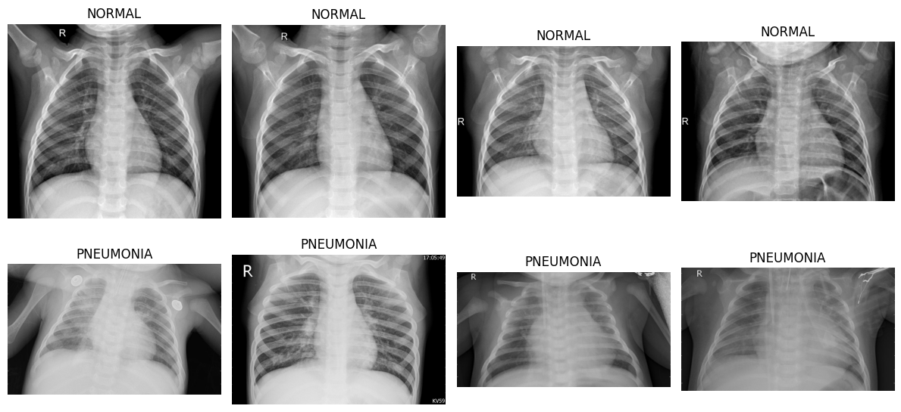
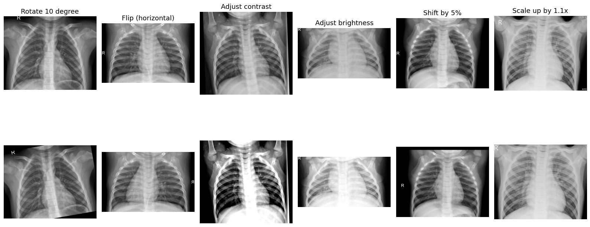
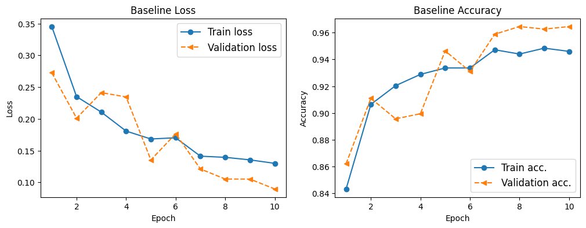
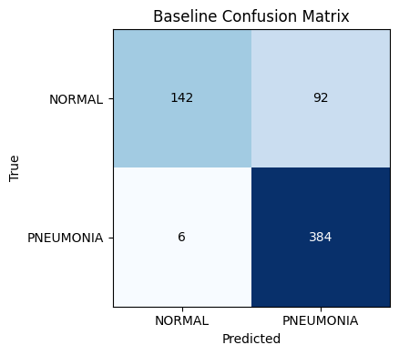
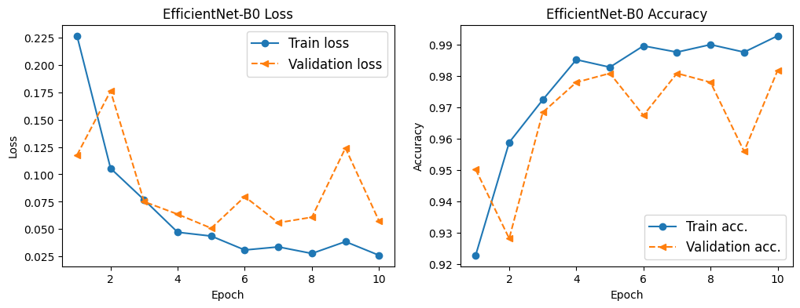
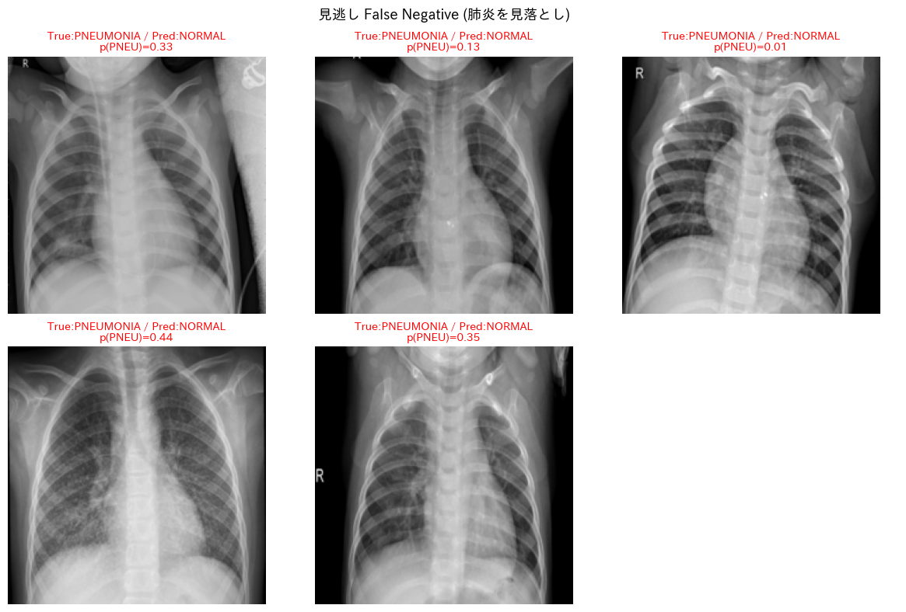
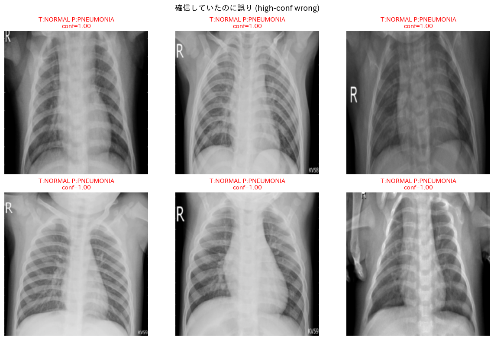
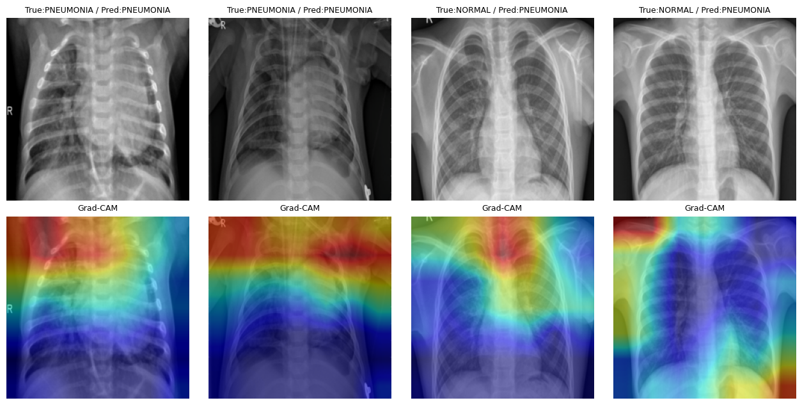

# 胸部X線画像による肺炎分類 (画像分類演習)

胸部X線画像から肺炎の有無 (`NORMAL` / `PNEUMONIA`) を分類する二値分類タスクの検証。
データ確認(EDA)→前処理→モデル比較(Baseline CNN / ResNet18 / EfficientNet-B0)→評価→誤分類分析→推論速度比較までを実装する。

> ⚠️ **本リポジトリは医療診断 AI ではありません。** 公開データセットを用いた画像分類タスクの再現性検証であり、臨床利用を目的としていません。

## プロジェクト概要

あなたは、医療画像を扱う研究支援チームに参加した機械学習エンジニアである。  
チームでは、胸部X線画像を分類する既存研究や公開データセットを調査し、社内PoCとして画像分類パイプラインを作ることになった。  

今回の依頼は、診断AIを作ることではなく、公開データセットを使い、データ確認、前処理、モデル比較、評価、誤分類分析までを一通り実装し、「画像分類タスクとしてどこまで再現性のある検証ができるか」を確認する。  

最終的には、モデルの性能だけでなく、クラス不均衡、見逃し、誤分類画像、推論速度などを含めて、チーム内でレビューできる資料にまとめる。  

- **比較モデル:** Baseline CNN(自作・1ch) / ResNet18(転移学習・3ch・Frozen) / ResNet18(転移学習・3ch・Fine-tuned) / EfficientNet-B0(転移学習・3ch)

## 使用データセット

Kaggle [Chest X-Ray Images (Pneumonia)](https://www.kaggle.com/datasets/paultimothymooney/chest-xray-pneumonia)

`train/ val/ test/`の各ディレクトリ下に `NORMAL/` `PNEUMONIA/`が並ぶ構成。  
元の`val/`は枚数が極端に少ないため、`train/`を層化抽出で訓練用と検証用に再分割し、`test/`を最終評価に使う。

## 実行環境

```bash
pip install -r requirements.txt
```

Python 3.10+ / PyTorch 2.x（GPU 推奨）。

## ディレクトリ構成

```
.
├── README.md
├── requirements.txt
├── notebooks/
│   └── pneumonia_classification.ipynb
├── src/
│   ├── dataset.py  
│   ├── models.py 
│   ├── train.py  
│   └── evaluate.py 
└── outputs/
    ├── figures/ 
    └── metrics/  
```

## 実行手順

1. データを`chest_xray/`（`train/ val/ test/`）として配置。Google Colabの場合、`/content/chest_xray`。
2. `notebooks/pneumonia_classification.ipynb`を開き、EDAセルの `DATA_DIR`を環境に合わせる。
3. 上から順にセルを実行する。
   - まずBaselineだけ試す場合は実行セルの`configs`を1行に絞る。
4. モデル比較表が`outputs/metrics/comparison.csv`に保存される。

## 評価指標

クラス不均衡(PNEUMONIA 多数)を踏まえ、Accuracyだけでなく**Recall(肺炎の見逃しにくさ)** とF1を重視する。  
Accuracy / Precision / Recall / F1-score・混同行列・誤分類画像・推論時間(ms/枚)・パラメータ数・モデルサイズ(MB)を出力する。

## 実験結果および考察
### 画像データの確認
本データセットには以下のようなデータが含まれている。  
  

### データの拡張(Augmentation)  
胸部X線画像は自然画像とは異なり、Augmentationを強くかけすぎると不自然な画像になる。  
医療画像として意味が崩れにくい範囲で処理することが重要である。  
例えば、`回転`、`左右反転`、`コントラスト調整`、`明るさ調整`、`平行移動`、`拡大縮小`などが推奨される。これらを画像に適応させると以下のようになる。  
  

今回は`回転(±10°)`、`平行移動(±5%)`、`拡大縮小(x0.95~1.05)`、`明るさ調整(±0,2)`、`コントラスト調整(±0.2)`をランダムに適応させるように設計している。  

### Baseline CNNの性能評価
 

|   | precision | recall | f1-score | data_counts | 
| --- | --- | --- | --- | ---|
| NORMAL | 0.96 | 0.61 | 0.74 | 234 |
| PNEUMONIA | 0.81 | 0.98 | 0.89 | 390 | 
| accuracy | - | - | 0.84 | 624 |



### ResNet18(Frozen)の性能評価
_train_accuracy.png) 

|   | precision | recall | f1-score | data_counts | 
| --- | --- | --- | --- | ---|
| NORMAL | 0.94 | 0.73 | 0.82 | 234 |
| PNEUMONIA | 0.86 | 0.97 | 0.91 | 390 | 
| accuracy | - | - | 0.88 | 624 |

_confusion matrix.png) 

### ResNet18(Fine-tuned)の性能評価
_train_accuracy.png) 

|   | precision | recall | f1-score | data_counts | 
| --- | --- | --- | --- | ---|
| NORMAL | 0.97 | 0.78 | 0.86 | 234 |
| PNEUMONIA | 0.88 | 0.99 | 0.93 | 390 | 
| accuracy | - | - | 0.91 | 624 |

_confusion matrix.png)

### EfficientNet-B0の性能評価
 

|   | precision | recall | f1-score | data_counts | 
| --- | --- | --- | --- | ---|
| NORMAL | 0.99 | 0.71 | 0.83 | 234 |
| PNEUMONIA | 0.85 | 0.99 | 0.92 | 390 | 
| accuracy | - | - | 0.89 | 624 |

 

### モデル比較表
|   | model | accuracy | precision | recall | f1 | 推論速度(ms/枚) | パラメータ数(million) | モデルサイズ | 
| --- | --- | --- | --- | --- | --- | --- | --- | --- |
| 0 | Baseline | 0.84 | 0.81 | 0.98 | 0.89 | 0.90 | 1.70 | 6.49 | 
| 1 | ResNet18(Frozen) | 0.88 | 0.86 | 0.97 | 0.91 | 1.19 | 11.18 | 42.64 |
| 2 | ResNet18(Fine-tuned) | 0.91 | 0.88 | 0.99 | 0.93 | 1.19 | 11.18 | 42.64 |
| 3 | EfficientNet-B0 | 0.89 | 0.85 | 0.99 | 0.92 | 1.63 | 4.01 | 15.30 |

### 誤分類分析(ResNet18(Fine-tuned))
ResNet18(Fine-tuned)で、誤分類したデータを2パターンに分けて以下に示している。  
1つ目は、見逃し（本当はPNEUMONIA(肺炎)だが誤ってNORMAL(正常)と判断）をしたデータ、2つ目は、誤検出(本当はNORMAL(正常)だがPNEUMONIA(肺炎)と判断)をしたデータである。

 

また、誤分類したデータの中でも、モデルが確信していた中で誤分類したデータとPNEUMONIAかNORMALか迷いながらも誤分類したデータを判定確率とともに表示したのが以下のデータである。

 

### Grad=CAM
Grad-CAMは、CNNが画像のどこを見てその判断を下したのかを可視化する手法である。  
この手法を用いて、ResNet18(Fine-tuned)が画像のどの部分を見て肺炎と判断しているのかを可視化した。

 

### 考察
今回得られた結果から、①モデル②誤分類画像の2つの観点から考察をしていきたい。  
まず、モデルについて、Baseline CNNモデルと比較した時に、転移学習モデルの方が僅かながら精度が高まったことが確認された。その中でも最も高い精度を出したのがResNet18(Fine-tuned)モデルであった。また、パラメータ数やモデルサイズがBaseline CNNと比べて数倍も大きい一方で、推論速度に大きな差がない点からしても、モデル性能という点でもResNet18(Fine-tuned)が高いことが分かった。さらに、今回の胸部X線画像のような医療画像を用いた分類タスクでは精度よりもRecallを重視するべきであるが、RecallにおいてもEfficientNet-B0と並んで全てのモデルの中でも最も高い数値を見せた。  
しかし、NORMAL(正常)とPNEUMONIA(肺炎)それぞれのクラス内でのRecallを見たときにNORMAL(正常)のRecallがPNEUMONIA(肺炎)と比べるとかなり低い値をとっていることが確認された。つまり、誤判定（本当はNORMAL(正常)だがPNEUMONIA(肺炎)と判断）が多いことを示している（すべてのモデルで共通して見られた所見である）。医療において見逃しが少ないことは望ましいが、誤判定が多いことは不要な検査を招くというトレードオフがある。
この原因としては、NORMAL(正常)234、PNEUMONIA(肺炎)390というクラス不均衡が、損失軽減のためにPNEUMONIA(肺炎)寄りに判定をしてしまったことが考えられる。  
そのため、モデルの閾値を見逃しが大きく増えない範囲で挙げてみること、また、`CrossEntropyLoss(weight=class_weights)`や`WeightedRandomSampler`を用いて、クラス不均衡による影響を抑える工夫を施すことが次の課題だと考えた。 

次に、誤分類画像についてだが、医療診断におけるX線画像の見方についてはもちろん分からないので、簡単に調べたドメイン知識と絡めながら画像から得られる情報のみで考察をする。人間の肺は正常であればほとんどが空気が占めているので、X線画像で肺は黒く映し出されるようである。しかし、肺炎によって肺に水がたまると、白く濁って映し出されることがあるようだ。  
それを踏まえて分析結果を見ると、今回見逃しをした画像は誤判定した画像に比べて肺部分が黒く、逆に誤判定した画像は濁り度合いが若干強い傾向にあるように思われたため、これが原因で誤分類したのではないかと考えた。
しかし、Grad-CAMでモデルが見ている箇所を可視化した時に、臨床で見ている箇所とは異なる箇所で強く反応していることが確認された。そのため、モデルが必ずしも正確に病変部分を見ているとは限らないと考えた。
この点に関しては、病変とは関係のない箇所は前処理の時点で取り除くことでより正確な分類ができるのではないかと考えた。

## 医療利用に関する注意

本リポジトリの成果物は学習・検証目的であり、**医療診断や臨床判断に用いることを意図していません。**
